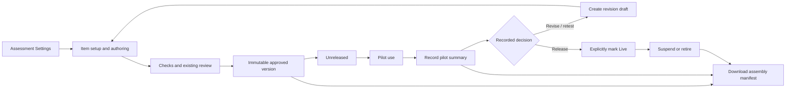

# Version use, pilot results and assembly preparation

The Workbench records the use of an **immutable item version** independently of content approval and the item's active / archived / deleted record state. This phase prepares the Workbench; it does not deploy, withdraw or change attempts in Exam Creator or Exam Environment.

## Using the feature

Open an item's **Submit** step and use **Version use and pilot results**. The panel appears when an approved version or prior use record exists; new drafts and first pending-review versions have no pilot panel. Select a frozen version to inspect its saved setup, date and approval eligibility. A newer draft does not change the selected version's history. Switching authoring steps preserves unsaved pilot entries. Unavailable approval is explained and cannot be bypassed by a usage decision.

1. Mark an approved version **Pilot** with a reason. Approval alone leaves it **Unreleased**.
2. Record a manual pilot summary with source, sample reference, cohort, sample size and decision notes. Optional statistics may be left blank; blank means unavailable, not zero.
3. Choose a conclusion: retain, revise, retest, release or retire. Saving that conclusion does not change the version's use state or its content.
4. A **Ready for formal use** conclusion (`release`) permits a separate action to mark the version **Released for formal use** (`live`). A newer conclusion supersedes the older release conclusion. After suspension, a new release conclusion is required before returning to Live.
5. A revise or retest conclusion can be linked to a new revision draft. If a draft already exists, continue it; starting another revision must not replace it. The source version and pilot record remain intact. New drafts do not inherit observed pilot statistics as evidence of their own performance.

Only an active item's owner can add usage events or pilot results. Authenticated users can inspect the records. If an intact version with prior use history loses approval, its owner can still suspend or retire it; further pilot or formal-use decisions require approval again. Retired versions retain their history and cannot return to use. Archiving or deleting an item is a separate record-management action; it does not create a retirement event.

## State rules

| Current state | Allowed next states |
| --- | --- |
| Unreleased | Pilot, Suspended, Retired |
| Pilot | Live, Suspended, Retired |
| Live | Suspended, Retired |
| Suspended | Pilot, Live, Retired |
| Retired | None |

Every status change requires a reason. Live additionally requires a current explicit release conclusion. No statistical threshold automatically approves, releases, changes the intended A1 band, edits an item or publishes Assessment Settings.

## Pilot statistics

- `sampleSize` is the number of observations represented by this report, not a cumulative counter across potentially overlapping reports.
- `correctCount` means fully correct observations and `omittedCount` means omitted observations in that same sample. Each is optional; when supplied they must fit within the sample and cannot overlap. Accuracy and omission percentages use this sample as denominator.
- `discrimination` is a correlation in [-1, 1]. Record the calculation and any exclusions in the report source or notes; values from different methods should not be silently pooled.
- `medianResponseTimeSeconds` is optional. A supplied value requires a known basis: elapsed time or active time. Elapsed time includes time between entry and exit; active time excludes the inactive periods specified by the measurement system. Describe navigation, pause, shared-stimulus and exclusion rules in source/notes. These manual summaries do not claim that Exam Environment already collects these measurements.
- Different reports are retained independently. The latest report supplies the latest conclusion; the Workbench does not combine overlapping cohorts or infer statistics from missing observations.

Pilot results are append-only. To correct a report, append a new report with its corrected data and explain which report it replaces in the notes. Earlier reports remain available in history.

## Assembly manifest

**Download assembly manifest** produces a metadata-only record from the selected frozen version. It pins item/version/content identity, Assessment Settings and schema references, Item rule identity, format, Can-do, Domain, Context, intended difficulty, language targets, renderer/scoring/delivery references and current Workbench availability.

The manifest excludes item text, answer keys, author translations and author notes. It is an assembly-preparation artifact, not a candidate delivery package. Availability for pilot or live assembly requires an active item, approved intact version and the corresponding recorded use state. Its usage revision is a point-in-time snapshot; a future assembler must recheck availability when reserving or delivering items.

## Storage and API

`LanguageItemVersionUsageEvents` is a dedicated Staging Workbench collection. An event pins `itemId`, `versionId`, `contentHash` and `registryVersion`, along with actor, timestamp, revision, request ID and state / pilot change. Unique indexes on version + revision and version + request ID provide ordered writes and retry protection. Reusing a request ID with different content is rejected. A concurrent write returns a conflict and must be reloaded before a new decision.

- `GET /api/language-items/{item_id}/usage`: immutable-version approval and usage summaries.
- `GET /api/language-items/{item_id}/versions/{version_id}/usage`: version summary and paginated append-only history.
- `POST /api/language-items/{item_id}/versions/{version_id}/usage`: append an owner-operated status change or manual pilot summary.
- `GET /api/language-items/{item_id}/versions/{version_id}/assembly-manifest`: download candidate-free assembly metadata.
- Existing `POST /api/language-item-versions/{version_id}/revise` accepts optional `usageEventId` to link a same-version revise / retest pilot conclusion to the revision audit event.

Review authority, frozen TaskPackage schemas, canonical item IDs, Coverage's saved core-target counts and existing Staging exports remain unchanged.

## Subsequent work

The next Workbench preparation layer is an exam-form plan with section / item rule counts, target difficulty mix, total planned duration, shared-material and incompatible-item constraints, and a shortage report against available immutable versions. It should consume the assembly manifest without creating another editable copy of item metadata.

Before automatic pilot import, define a delivery receipt and event contract carrying form version, item version, pseudonymous attempt identity, item position, presented time, answer updates, item enter/leave, pause/resume, visibility and completion reason. Record server receipt time separately from client event time; deduplicate event IDs; retain omissions and interrupted attempts. Calculate elapsed and active time separately, and keep shared-stimulus reading time at its proper level. Full legacy integration and data collection are a later phase.
